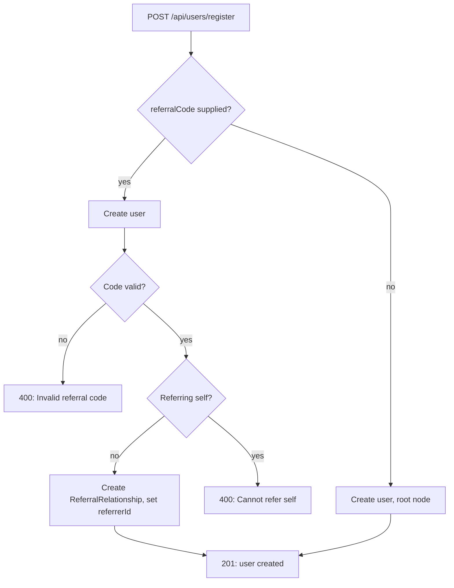
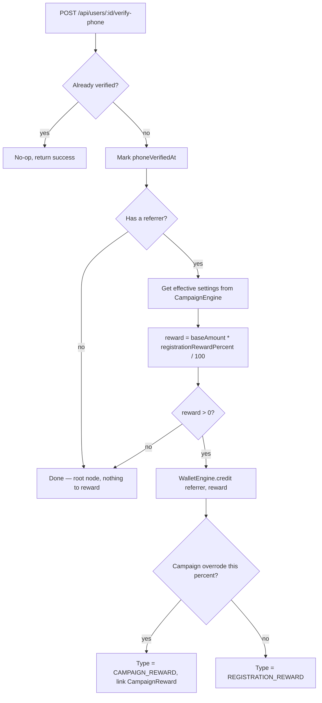
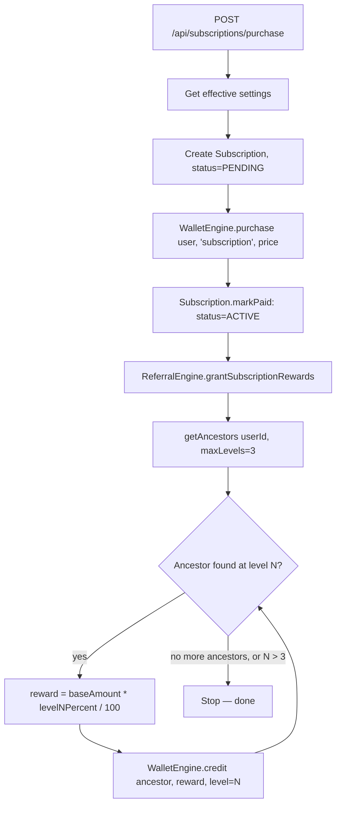
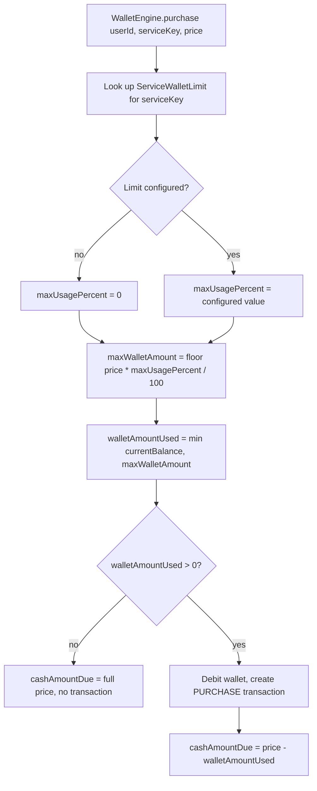

# Flowcharts

## Registration + referral application

```mermaid
flowchart TD
    A[POST /api/users/register] --> B{referralCode supplied?}
    B -- no --> C[Create user, root node]
    B -- yes --> D[Create user]
    D --> E{Code valid?}
    E -- no --> F[400: Invalid referral code]
    E -- yes --> G{Referring self?}
    G -- yes --> H[400: Cannot refer self]
    G -- no --> I[Create ReferralRelationship, set referrerId]
    I --> J[201: user created]
    C --> J
```

## Phone verification → Registration Reward

```mermaid
flowchart TD
    A[POST /api/users/:id/verify-phone] --> B{Already verified?}
    B -- yes --> C[No-op, return success]
    B -- no --> D[Mark phoneVerifiedAt]
    D --> E{Has a referrer?}
    E -- no --> F[Done — root node, nothing to reward]
    E -- yes --> G[Get effective settings from CampaignEngine]
    G --> H[reward = baseAmount * registrationRewardPercent / 100]
    H --> I{reward > 0?}
    I -- no --> F
    I -- yes --> J[WalletEngine.credit referrer, reward]
    J --> K{Campaign overrode this percent?}
    K -- yes --> L[Type = CAMPAIGN_REWARD, link CampaignReward]
    K -- no --> M[Type = REGISTRATION_REWARD]
```

## Subscription purchase → multi-level rewards

```mermaid
flowchart TD
    A[POST /api/subscriptions/purchase] --> B[Get effective settings]
    B --> C[Create Subscription, status=PENDING]
    C --> D[WalletEngine.purchase user, 'subscription', price]
    D --> E[Subscription.markPaid: status=ACTIVE]
    E --> F[ReferralEngine.grantSubscriptionRewards]
    F --> G[getAncestors userId, maxLevels=3]
    G --> H{Ancestor found at level N?}
    H -- yes --> I[reward = baseAmount * levelNPercent / 100]
    I --> J[WalletEngine.credit ancestor, reward, level=N]
    J --> H
    H -- no more ancestors, or N > 3 --> K[Stop — done]
```

## Wallet-funded purchase

```mermaid
flowchart TD
    A[WalletEngine.purchase userId, serviceKey, price] --> B[Look up ServiceWalletLimit for serviceKey]
    B --> C{Limit configured?}
    C -- no --> D[maxUsagePercent = 0]
    C -- yes --> E[maxUsagePercent = configured value]
    D --> F[maxWalletAmount = floor price * maxUsagePercent / 100]
    E --> F
    F --> G[walletAmountUsed = min currentBalance, maxWalletAmount]
    G --> H{walletAmountUsed > 0?}
    H -- no --> I[cashAmountDue = full price, no transaction]
    H -- yes --> J[Debit wallet, create PURCHASE transaction]
    J --> K[cashAmountDue = price - walletAmountUsed]
```
