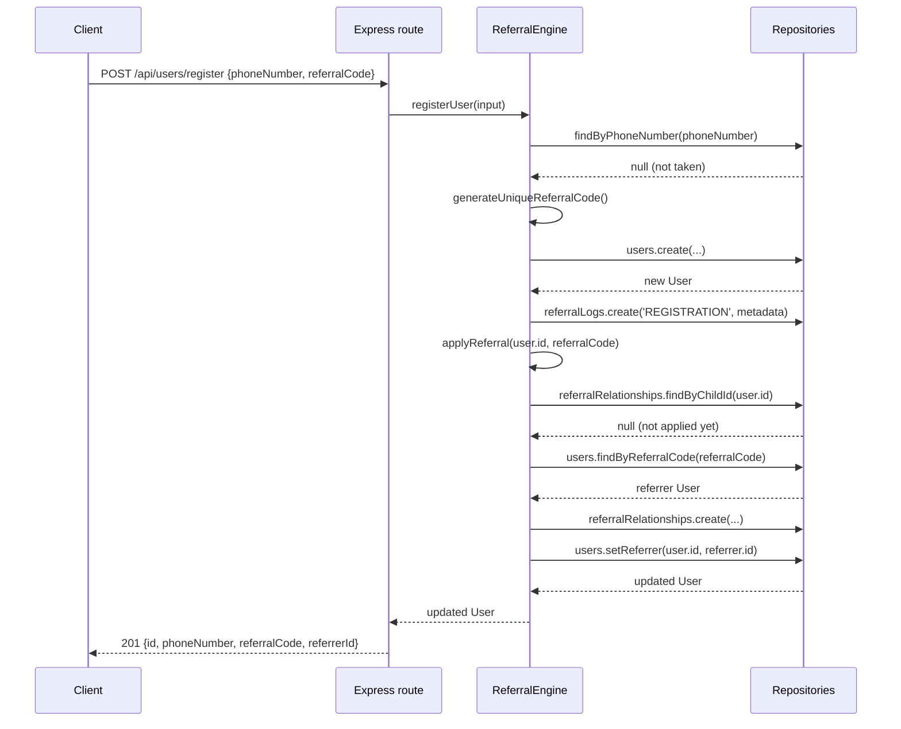
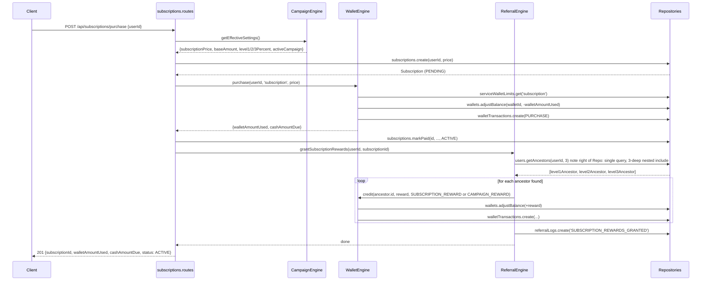
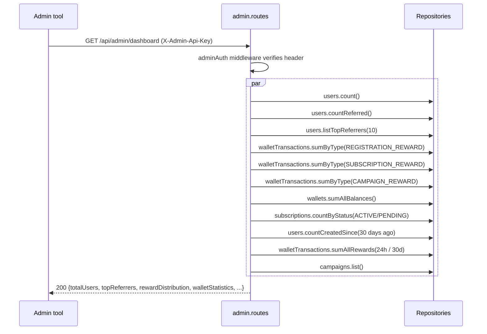

# Sequence Diagrams

## Registering with a referral code

```mermaid
sequenceDiagram
    participant Client
    participant API as Express route
    participant RE as ReferralEngine
    participant Repo as Repositories

    Client->>API: POST /api/users/register {phoneNumber, referralCode}
    API->>RE: registerUser(input)
    RE->>Repo: findByPhoneNumber(phoneNumber)
    Repo-->>RE: null (not taken)
    RE->>RE: generateUniqueReferralCode()
    RE->>Repo: users.create(...)
    Repo-->>RE: new User
    RE->>Repo: referralLogs.create('REGISTRATION', metadata)
    RE->>RE: applyReferral(user.id, referralCode)
    RE->>Repo: referralRelationships.findByChildId(user.id)
    Repo-->>RE: null (not applied yet)
    RE->>Repo: users.findByReferralCode(referralCode)
    Repo-->>RE: referrer User
    RE->>Repo: referralRelationships.create(...)
    RE->>Repo: users.setReferrer(user.id, referrer.id)
    Repo-->>RE: updated User
    RE-->>API: updated User
    API-->>Client: 201 {id, phoneNumber, referralCode, referrerId}
```

## Subscription purchase granting three levels of rewards

```mermaid
sequenceDiagram
    participant Client
    participant API as subscriptions.routes
    participant CE as CampaignEngine
    participant WE as WalletEngine
    participant RE as ReferralEngine
    participant Repo as Repositories

    Client->>API: POST /api/subscriptions/purchase {userId}
    API->>CE: getEffectiveSettings()
    CE-->>API: {subscriptionPrice, baseAmount, level1/2/3Percent, activeCampaign}
    API->>Repo: subscriptions.create(userId, price)
    Repo-->>API: Subscription (PENDING)
    API->>WE: purchase(userId, 'subscription', price)
    WE->>Repo: serviceWalletLimits.get('subscription')
    WE->>Repo: wallets.adjustBalance(walletId, -walletAmountUsed)
    WE->>Repo: walletTransactions.create(PURCHASE)
    WE-->>API: {walletAmountUsed, cashAmountDue}
    API->>Repo: subscriptions.markPaid(id, ..., ACTIVE)
    API->>RE: grantSubscriptionRewards(userId, subscriptionId)
    RE->>Repo: users.getAncestors(userId, 3)  note right of Repo: single query, 3-deep nested include
    Repo-->>RE: [level1Ancestor, level2Ancestor, level3Ancestor]
    loop for each ancestor found
        RE->>WE: credit(ancestor.id, reward, SUBSCRIPTION_REWARD or CAMPAIGN_REWARD)
        WE->>Repo: wallets.adjustBalance(+reward)
        WE->>Repo: walletTransactions.create(...)
    end
    RE->>Repo: referralLogs.create('SUBSCRIPTION_REWARDS_GRANTED')
    RE-->>API: done
    API-->>Client: 201 {subscriptionId, walletAmountUsed, cashAmountDue, status: ACTIVE}
```

## Admin dashboard read

```mermaid
sequenceDiagram
    participant Admin as Admin tool
    participant API as admin.routes
    participant Repo as Repositories

    Admin->>API: GET /api/admin/dashboard (X-Admin-Api-Key)
    API->>API: adminAuth middleware verifies header
    par
        API->>Repo: users.count()
        API->>Repo: users.countReferred()
        API->>Repo: users.listTopReferrers(10)
        API->>Repo: walletTransactions.sumByType(REGISTRATION_REWARD)
        API->>Repo: walletTransactions.sumByType(SUBSCRIPTION_REWARD)
        API->>Repo: walletTransactions.sumByType(CAMPAIGN_REWARD)
        API->>Repo: wallets.sumAllBalances()
        API->>Repo: subscriptions.countByStatus(ACTIVE/PENDING)
        API->>Repo: users.countCreatedSince(30 days ago)
        API->>Repo: walletTransactions.sumAllRewards(24h / 30d)
        API->>Repo: campaigns.list()
    end
    API-->>Admin: 200 {totalUsers, topReferrers, rewardDistribution, walletStatistics, ...}
```
